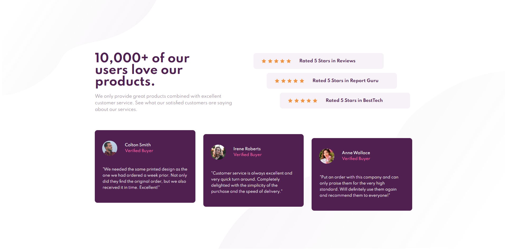
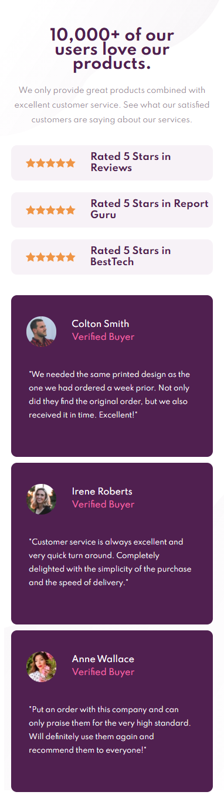

# Frontend Mentor - Social proof section solution

This is a solution to the [Social proof section challenge on Frontend Mentor](https://www.frontendmentor.io/challenges/social-proof-section-6e0qTv_bA). Frontend Mentor challenges help you improve your coding skills by building realistic projects. 

## Table of contents

- [Overview](#overview)
  - [The challenge](#the-challenge)
  - [Screenshot](#screenshot)
- [My process](#my-process)
  - [Built with](#built-with)
  - [What I learned](#what-i-learned)
  - [Continued development](#continued-development)
- [Author](#author)


## Overview

### The challenge

The design should be able to be viewed properly on desktop and mobiles.

### Screenshot


<p align="center">
  
</p>

## My process

### Built with

- Semantic HTML5 markup
- CSS properties
- Flexbox

### What I learned

I learnt how to construct the layout with divs in HTML and flex property in CSS and how to resize divs with the percentages to make it easy to turn the design to a responsive one

for example:
```html
  <div class="desc">
       <div class="heading">10,000+ of our users love our products.</div>
          <div class="info">
            We only provide great products combined with excellent customer
            service. See what our satisfied customers are saying about our
            services.
       </div>
  </div>
```
in the font-size and width of the desc div i used percentage to make it flexable to resize with the parent section so no need to resize them again
```css
.section-1 .desc {
    margin-top: 50px;
    font-size: 80%;
    width: 100%;
    text-align: center;
    padding: 0;
    display: flex;
    flex-direction: column;
    align-items: center;
  }
}
```


### Continued development

In the future I will try different ways to build the layout of the page. I will search more on grid and practice more on using flexbox

## Author

- Behance - [Mahmoud Ashraf](https://www.behance.net/m_ashraffarouk/)
- Frontend Mentor - [@m-Ash1](https://www.frontendmentor.io/profile/m-Ash1)
- Twitter - [@m_ashraffarouk](https://www.twitter.com/m_ashraffarouk)


